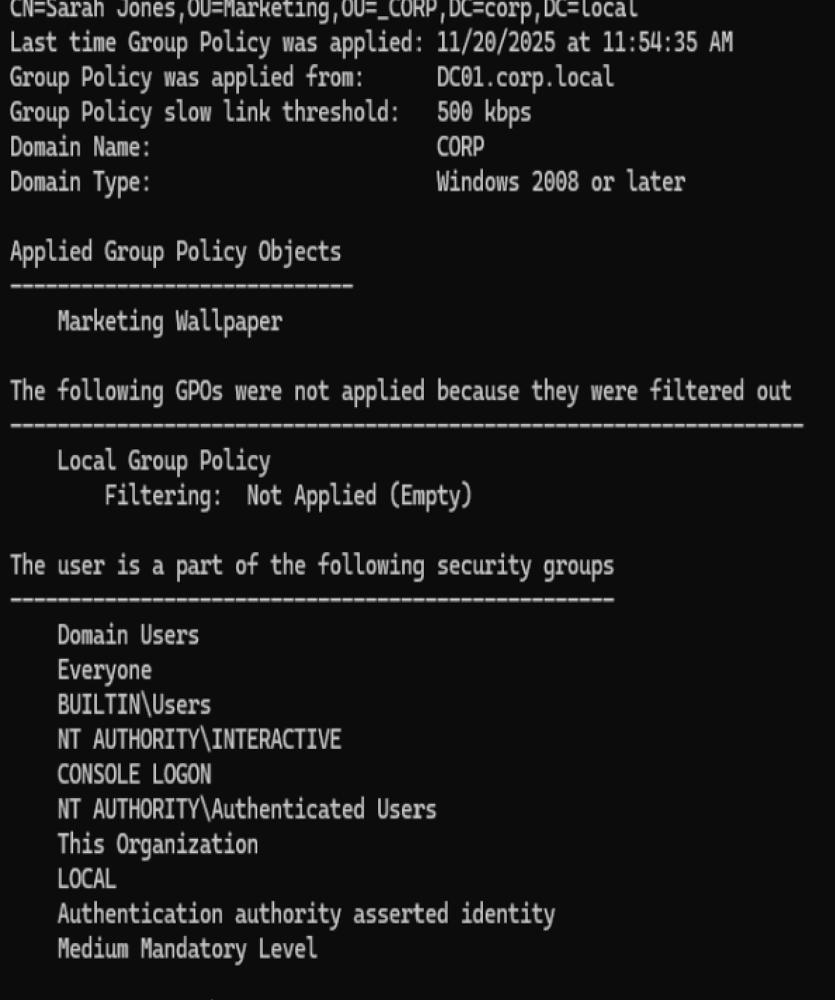
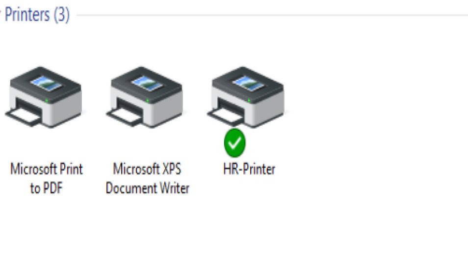
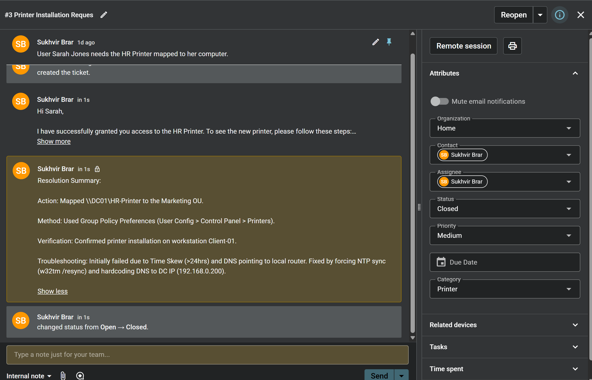

# Active-Directory-Home-Lab
A virtualized simulation of a corporate IT environment using Windows Server 2022 and Windows 11 to practice Help Desk ticketing, AD management, and troubleshooting.
# Active Directory Home Lab Environment

## Project Overview
This project consists of a simulated corporate IT infrastructure designed to mimic a real-world Help Desk environment. The goal was to build a domain network from scratch, configure a Domain Controller, and manage users and workstations to simulate day-to-day IT support tasks.

### 🛠 Tools & Technologies Used
* **Hypervisor:** Oracle VirtualBox
* **Server OS:** Windows Server 2022 (Desktop Experience)
* **Client OS:** Windows 11 Enterprise
* **Network:** Bridged Adapter Configuration with Static IP Addressing
* **Core Services:** Active Directory Domain Services (AD DS), DNS, DHCP

## 🏗 Architecture & Configuration
I configured a private virtual network where the Windows Server acts as the Primary Domain Controller (PDC) and DNS server for the Windows 11 client.

### 1. Network Configuration
* **Server IP:** `192.168.0.200` (Static)
* **Client DNS:** Pointed to Server (`192.168.0.200`) to enable domain resolution.
* **Verification:** Successfully verified connectivity via ICMP (Ping) before attempting domain join.

### 2. Active Directory Deployment
* Promoted Windows Server 2022 to a Domain Controller.
* Created a new forest: `corp.local`.
* Configured a dedicated Organizational Unit (OU) structure for departmental management (e.g., Marketing, HR).

### 3. Client Onboarding
* Provisioned a Windows 11 Enterprise workstation.
* Joined the workstation to the `corp.local` domain.
* Verified the "Handshake" between client and server via successful domain login.

## 🎯 Key Skills Demonstrated
* **Infrastructure Setup:** Installing and configuring Windows Server in a virtualized environment.
* **Networking:** Understanding Subnetting, Static IPs, and DNS resolution.
* **Troubleshooting:** Diagnosing connectivity issues between VMs on different subnets.
* **Administration:** User account creation, password management, and security policy implementation.

## Project 1: User Security & Permissions
**Objective:** Demonstrated the Principle of Least Privilege by creating standard user accounts and verifying they cannot modify system-level settings.

*Evidence: The standard user 'sjones' is blocked by UAC when attempting to change the system time, requiring Administrator credentials.*

### 🔧 Troubleshooting Highlight: DNS & Time Skew
**Issue:** The GPO initially failed with a "Clock Skew" error.
**Diagnosis:** Active Directory relies on Kerberos, which requires client/server clocks to be synced within 5 minutes. The client VM had drifted.
**Resolution:**
1. Manually synchronized Client clock to DC01 time.
2. Ran `w32tm /resync` to lock the time.
3. Ran `gpupdate /force` which completed successfully.

**Final Result:**

*Evidence: Corporate wallpaper applied automatically to the Marketing department.*

## Project 3: Automated Printer Deployment & GPO Troubleshooting
**Objective:** Automate the deployment of shared network printers to specific departments using Group Policy Preferences (GPP), reducing manual installation tickets.

### 🎫 The Scenario (Spiceworks Ticket #1003)
* **Request:** Marketing user **Sarah Jones** submitted a ticket stating she could not access the department's "HR-Printer."
* **Goal:** Map the printer automatically so it appears every time she logs in, without requiring Admin rights.

### 🛠️ Technical Implementation
1.  **Server-Side Setup:**
    * Created a "Ghost Printer" on **Server 2022** using a Local Port (`C:\Printers\HR-Output.txt`) to simulate physical hardware in a virtual environment.
    * Configured Printer Sharing (`\\DC01\HR-Printer`) to make it accessible across the domain.
2.  **Group Policy Configuration:**
    * Edited the `Marketing` GPO.
    * Navigate to: **User Configuration > Preferences > Control Panel Settings > Printers**.
    * Configured a **Shared Printer** object to Create/Update the connection to `\\DC01\HR-Printer`.
    * Targeted specifically to the **Marketing OU**.

### 🔧 Critical Troubleshooting (The "Real World" Challenges)
During deployment, the GPO initially failed to apply. I diagnosed and resolved the following root causes:

* **Issue 1: Time Skew (Kerberos Failure)**
    * *Symptom:* Client rejected the GPO with a "Clock Skew" error.
    * *Diagnosis:* The VM had drifted >24 hours behind the Domain Controller, breaking Kerberos authentication.
    * *Fix:* Manually synchronized Server time via Command Line (`date` / `time`) and forced Client sync using `w32tm /resync`.

* **Issue 2: Name Resolution Failure (DNS)**
    * *Symptom:* `gpupdate` failed with "Windows could not resolve the computer name."
    * *Diagnosis:* Client `nslookup` failed to find `corp.local`.
    * *Fix:* Hardcoded the Client's DNS to point strictly to the Domain Controller (`192.168.0.200`) and flushed the cache (`ipconfig /flushdns`).

* **Issue 3: Network Isolation (Firewall)**
    * *Symptom:* DNS worked, but GPO download timed out.
    * *Fix:* Configured Windows Defender Firewall on the Server to allow domain traffic.

### 📸 Evidence of Success

**1. Verification on Client Workstation:**
*The "HR-Printer" automatically appeared in Sarah's settings after a successful `gpupdate` and login.*

**2. Ticket Lifecycle (Spiceworks):**
*Ticket documented with resolution steps and closed.*

