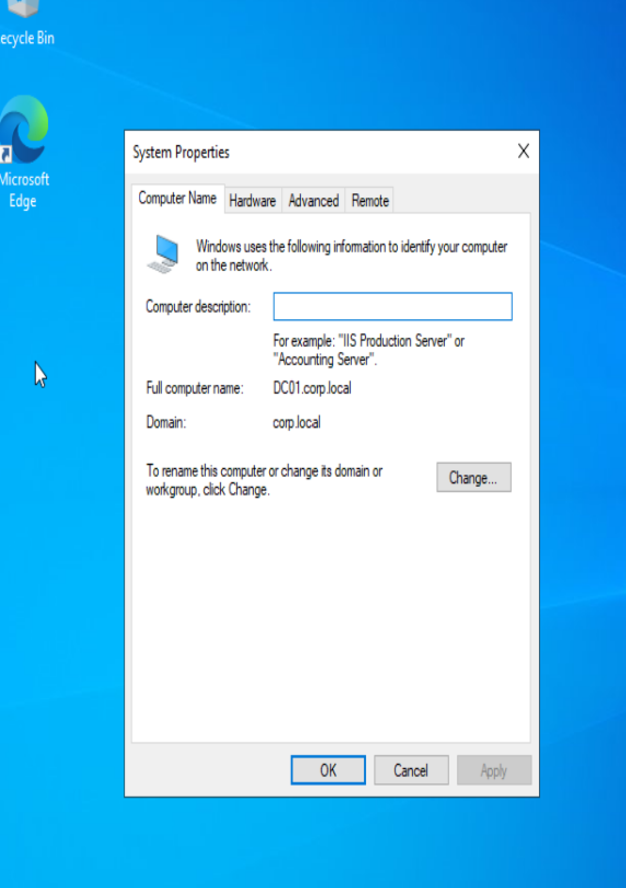
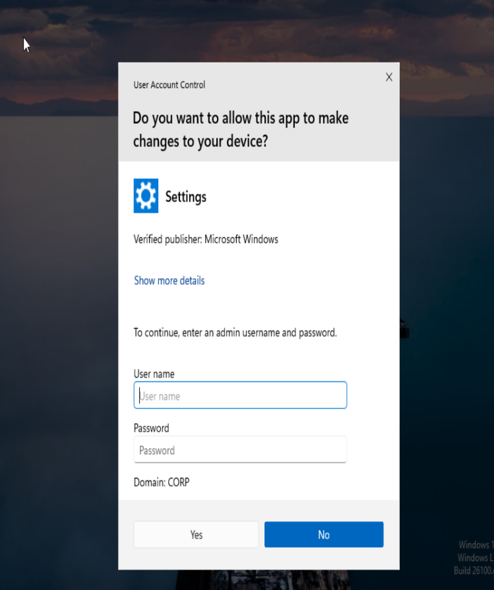

# Active-Directory-Home-Lab
A virtualized simulation of a corporate IT environment using Windows Server 2022 and Windows 11 to practice Help Desk ticketing, AD management, and troubleshooting.
# Active Directory Home Lab Environment

## Project Overview
This project consists of a simulated corporate IT infrastructure designed to mimic a real-world Help Desk environment. The goal was to build a domain network from scratch, configure a Domain Controller, and manage users and workstations to simulate day-to-day IT support tasks.

### 🛠 Tools & Technologies Used
* **Hypervisor:** Oracle VirtualBox
* **Server OS:** Windows Server 2022 (Desktop Experience)
* **Client OS:** Windows 11 Enterprise
* **Network:** Bridged Adapter Configuration with Static IP Addressing
* **Core Services:** Active Directory Domain Services (AD DS), DNS, DHCP

## 🏗 Architecture & Configuration
I configured a private virtual network where the Windows Server acts as the Primary Domain Controller (PDC) and DNS server for the Windows 11 client.

### 1. Network Configuration
* **Server IP:** `192.168.0.200` (Static)
* **Client DNS:** Pointed to Server (`192.168.0.200`) to enable domain resolution.
* **Verification:** Successfully verified connectivity via ICMP (Ping) before attempting domain join.

### 2. Active Directory Deployment
* Promoted Windows Server 2022 to a Domain Controller.
* Created a new forest: `corp.local`.
* Configured a dedicated Organizational Unit (OU) structure for departmental management (e.g., Marketing, HR).

### 3. Client Onboarding
* Provisioned a Windows 11 Enterprise workstation.
* Joined the workstation to the `corp.local` domain.
* Verified the "Handshake" between client and server via successful domain login.

## 🎯 Key Skills Demonstrated
* **Infrastructure Setup:** Installing and configuring Windows Server in a virtualized environment.
* **Networking:** Understanding Subnetting, Static IPs, and DNS resolution.
* **Troubleshooting:** Diagnosing connectivity issues between VMs on different subnets.
* **Administration:** User account creation, password management, and security policy implementation.

## Project 1: User Security & Permissions
**Objective:** Demonstrated the Principle of Least Privilege by creating standard user accounts and verifying they cannot modify system-level settings.

*Evidence: The standard user 'sjones' is blocked by UAC when attempting to change the system time, requiring Administrator credentials.*

